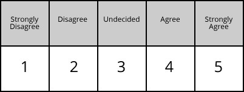

---
title:
author: "cjlortie"
date: "August 2016"
output:
  html_document:
    theme: yeti
    toc: yes
    toc_depth: 3
    toc_float: yes
  pdf_document:
    toc: yes
---
##A set of products associated with best experimental design

###Hypothesis
Best experimental design can be captured and summarized simply.


[cjlortie](http://christopherlortie.info)

###Methods

We developed a set of best experimental design principles using peer-reviewed comment papers on the topic, field notes, and discussion. The format to present and summarize was open. The following questions were scored on a Likert scale from 1 to 5: 
(1) Did you provide sufficient evidence you processed the readings?
(2) Is the heuristic you provided useful in designing experiments for ecology?
(3) Is the product (flowchart, table, decision tree, ten simple rules, etc) clear and direct?
(4) Is the case study example with hypothesis and predictions precise and linked to design?

The data structure from asking these questions is thus the marking key and then a spreadsheet with name, and a column for each question with a score of 1-5.



```{r, setup, include=FALSE}
knitr::opts_chunk$set(cache=TRUE)
#library loads ####
library(dplyr)
library(lme4)
library(lattice)
library(latticeExtra)


##load functions ####
error.bar <- function(x, y, upper, lower=upper, length=0,...){
  if(length(x) != length(y) | length(y) !=length(lower) | length(lower) != length(upper))
    stop("vectors must be same length")
  arrows(x,y+upper, x, y-lower, angle=90, code=3, length=0, ...)
}
se <- function(x) sd(x)/sqrt(length(x)) ## SE
```
